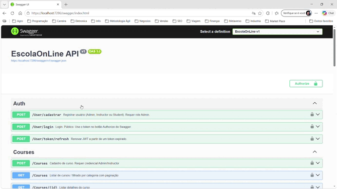
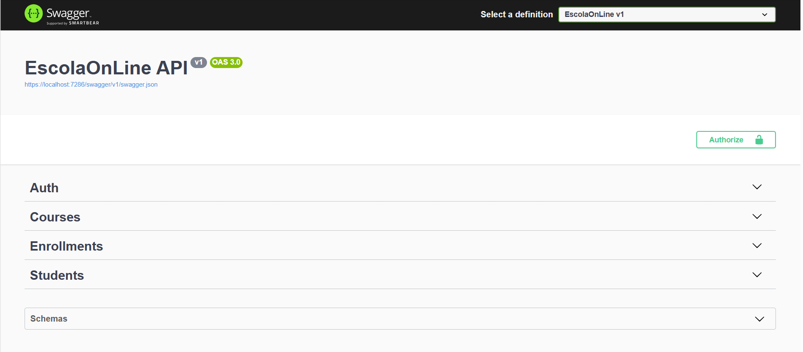
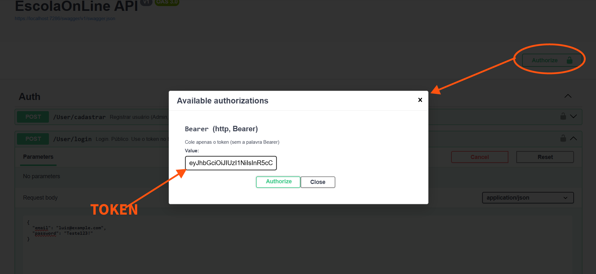

# EscolaOnLine API
API REST para uma escola online: autenticação JWT, cursos, estudantes e matrículas, com controle de acesso por papéis (**Admin**, **Instructor**, **Student**).

Objetivo: permitir que administradores e instrutores gerenciem o catálogo de cursos, que alunos se cadastrem e matriculem-se sem duplicidade, e que erros e autenticação sejam consistentes (ProblemDetails + Bearer).

## Requisitos

- [.NET 8 SDK](https://dotnet.microsoft.com/download)
- Banco em desenvolvimento: **SQLite** (arquivo local via EF Core)
- Ferramenta de migrations (opcional, mas recomendada):

> dotnet tool install --global dotnet-ef

## Como rodar o projeto localmente
> git clone https://github.com/lpmodos/escola-online.git

> cd escola-online

> dotnet restore

> dotnet ef database update

> dotnet run

A API estará disponível em https://localhost:[porta]  

## Segredos e configurações (desenvolvimento)
> dotnet user-secrets init

> dotnet user-secrets set "Jwt:Key" "cole-uma-chave-longa-aqui"

> dotnet user-secrets set "Jwt:Issuer" "EscolaOnLine"

> dotnet user-secrets set "Jwt:Audience" "EscolaOnLine"

> dotnet user-secrets set "ConnectionStrings:DefaultConnection" "Data Source=escola.db"

Os nomes das chaves devem bater com o appsettings.json / Program.cs.

Em CI/produção use variáveis de ambiente equivalentes (Jwt__Key, ConnectionStrings__DefaultConnection).

## Migrations
Criar uma nova migration (depois de alterar entidades):
> dotnet ef migrations add NomeDaAlteracao

Aplicar no banco local:
> dotnet ef database update

O seed (roles + usuário Admin) roda de forma idempotente na inicialização. Credenciais do admin de desenvolvimento (altere se o seed for outro):

e-mail: admin@escolaonline.com
senha: Senha@123

## Acessar o Swagger

Abra no navegador: https://localhost:[porta]/swagger
(exemplo: https://localhost:7286/swagger/index.html)

## Autenticar no Swagger

- Execute a API e acesse: https://localhost:[porta]/swagger

- Faça um POST em /user/login com e-mail e senha:
{
  "email": "admin@escolaonline.com",
  "password": "Senha@123"
}

- Copie o valor do campo token da resposta
- Clique no botão Authorize
- Cole o token no formato Bearer <seu_token> e confirme

- Agora você pode chamar as rotas protegidas (ícone de cadeado)

Arquivo de requests: EscolaOnLine.http (copie o token para @token).

## Rodar os testes

> dotnet test

## Exemplos de Requests

Requests de exemplo: [`EscolaOnLine.http`](./EscolaOnLine.http).
Após o login, copie o `token` para `@token`

## Requisitos Funcionais

- Autenticar usuários (registro e login) e emitir JWT
- Controle de acesso por papéis: Admin, Instructor e Student
- Cursos
- Criar (Admin / Instructor)
- Listar com paginação e filtros (público)
- Detalhar (público)
- Atualizar (Admin / Instructor)
- Remover (Admin)

- Estudantes
- Criar perfil vinculado ao usuário (Admin)
- Listar (Admin)
- Detalhar / Atualizar (Admin ou o próprio estudante)
- Desativar / Remover (Admin)

- Matrículas
- Matricular estudante autenticado em um curso
- Impedir matrícula duplicada
- Listar matrículas do próprio estudante (ou Admin)

- Validações:
	Título do curso ≥ 3 caracteres
	E-mail de estudante válido e único

- Respostas de erro padronizadas com status HTTP e mensagem clara
- Documentação Swagger com esquema Bearer e exemplos

## Requisitos Técnicos

- .NET 8 + ASP.NET Core Web API
- Entity Framework Core (SQLite em desenvolvimento; SQL Server/PostgreSQL em produção)
- ASP.NET Core Identity + JWT Bearer
- Configurações via variáveis de ambiente / user-secrets (nenhum segredo no repositório)
- Migrations aplicadas + seed mínimo (papéis + usuário admin) de forma idempotente
- Índices e constraints:
- E-mail único
- Unicidade de matrícula (Student + Course)
- DTOs separados das entidades
- Paginação e filtros via query string
- Swagger/OpenAPI com Security Scheme Bearer
- HTTPS habilitado
- CORS restrito às origens necessárias

## Tabelas:

1. Courses
   - Id (PK, int)
   - Titulo (string, max 100, required)
   - Descricao (string, required)
   - Categoria (string, max 30, required) → índice
   - CargaHoraria (int, required, > 0) 
   - DataCriacao (datetime)
   - IsDeleted (bool)

2. Students
   - Id (PK, int)
   - NomeCompleto (string, max 100, required)
   - Email (string, unique, required)
   - UserId (string, FK → AspNetUsers, required)
   - DataCadastro (datetime)
   - IsDeleted (bool)

3. Enrollments (tabela de junção explícita)
   - CourseId (PK, FK → Courses)
   - StudentId (PK, FK → Students)
   - Status (enum: Ativo/Cancelado)
   - DataMatricula (datetime)
   - IsDeleted (bool)

## Regras de negócio:
- Um aluno não pode se matricular duas vezes no mesmo curso (PK composta)
- Email do aluno deve ser único
- Carga horária deve ser > 0 e em segundos

## Autenticação (JWT)
A API utiliza ASP.NET Core Identity + JWT Bearer.

### Roles disponíveis

- Admin
- Instructor
- Student

### Endpoints de autenticação

#### 1. Registrar novo usuário

Método: POST
Rota: /user/cadastrar
Autenticação: Não requer

Body:
text{
  "email": "aluno@email.com",
  "password": "Senha@123",
  "nomeCompleto": "João da Silva",
  "role": "Student"
}
Resposta (201):
text{
  "message": "Usuário registrado com sucesso"
}

#### 2. Login

Método: POST
Rota: /user/login
Autenticação: Não requer

Body:
text{
  "email": "aluno@email.com",
  "password": "Senha@123"
}
Resposta (200):
text{
  "token": "eyJhbGciOiJIUzI1NiIsInR5cCI6IkpXVCJ9...",
  "expiration": "2026-08-08T18:00:00Z",
  "refreshToken": "/user/token/refresh"
}

#### 3. Refresh Token

Método: POST
Rota: /user/token/refresh
Autenticação: Não requer

Body:
text{
  "token": "eyJhbGciOiJIUzI1NiIsInR5cCI6IkpXVCJ9..."
}
Resposta (200):
text{
  "token": "eyJhbGciOiJIUzI1NiIsInR5cCI6IkpXVCJ9...",
  "expiration": "2026-08-08T18:00:00Z",
  "refreshToken": "/user/token/refresh"
}

## Erros

### Códigos de status esperados

Status	Significado
400		Entrada inválida
401		Não autenticado
403		Sem permissão
404		Não encontrado
409		Conflito (e-mail/matrícula)
422		Regra de negócio

### Erros padronizados (RFC 7807):

{
  "type": "https://httpstatuses.com/404",
  "title": "Not Found",
  "status": 404,
  "detail": "Curso não encontrado.",
  "instance": "/Courses/99"
}

### Validação (400) / ValidationProblemDetails

{
  "title": "One or more validation errors occurred.",
  "status": 400,
  "errors": {
    "Titulo": [ "Título deve ter no mínimo 3 caracteres." ]
  }
}

## Paginação e filtros

### Cursos (`GET /Courses`) — público
| Query | Default | Notas |
|-------|---------|--------|
| `pagina` | 1 | ≥ 1; **20** itens por página |
| `categoria` | — | igualdade, case-insensitive |
| `titulo` | — | contém no título |
| `ordenarPor` | `data` | `titulo` ou `data` |
| `direcao` | `desc` | `asc` ou `desc` |

Exemplo: `/Courses?pagina=2&categoria=Dev&ordenarPor=titulo&direcao=asc`

### Estudantes (`GET /Students`) — Admin
| Query | Default | Notas |
|-------|---------|--------|
| `pagina` | 1 | ≥ 1; **20** itens |
| `nome` | — | contém em NomeCompleto |
| `ordenarPor` | data de cadastro | `nome` ou `id` |
| `direcao` | `desc` | `asc` ou `desc` |

Exemplo: `/Students?pagina=2&ordenarPor=nome&direcao=asc`

## Endpoints principais
| Método | Rota | Auth / role | Descrição |
|-------|---------|-----------|--------|
|POST|/User/login|Anônimo|Login; devolve JWT
|POST|/User/token/refresh|AnônimoRenova token
|POST|/User/cadastrar|Admin|Cria usuário (qualquer role)
|GET|/Courses|Anônimo|Lista cursos (paginado/filtros)
|GET|/Courses/{id}|Anônimo|Detalhe do curso
|POST|/Courses|Admin, Instructor|Cria curso
|PUT|/Courses/{id}|Admin, Instructor|Atualiza curso
|DELETE|/Courses/{id}|AdminRemove curso|POST/StudentsAnônimo*Cria estudante
|GET|/Students|Admin|Lista estudantes
|GET|/Students/me||Autenticado|Perfil do aluno logado
|GET|/Students/{id}|Admin ou o próprio|Detalhe
|PUT|/Students/{id}|Admin ou o próprio|Atualiza
|DELETE|/Students/{id}|Admin|Soft/hard delete
|GET|/Students/{id}/enrollments|Admin ou o próprio|Cursos do aluno
|POST|/Enrollments|Autenticado|Matricula (aluno = si mesmo; Admin informa studentId)
|DELETE|/Enrollments|Autenticado|Cancela matrícula

## Banco de Dados

- Utilizado SQlite 
- Possui Seeder para pré-carregamento de dados inciais (Roles / Usuário Admin), configuração em Data/DBSeeder

## Dependências / Pacotes
  
- AutoMapper - 15.1.3
- Microsoft.AspNetCore.Authentication.JwtBearer - 8.0.29
- Microsoft.AspNetCore.Identity.EntityFrameworkCore - 8.0.29
- Microsoft.EntityFrameworkCore - 8.0.29
- Microsoft.EntityFrameworkCore.Design - 8.0.29
- Microsoft.EntityFrameworkCore.Sqlite - 8.0.29
- Microsoft.EntityFrameworkCore.Tools - 8.0.29
- SQLitePCLRaw.lib.e_sqlite3 - 3.53.3
- Swashbuckle.AspNetCore - 6.6.2
